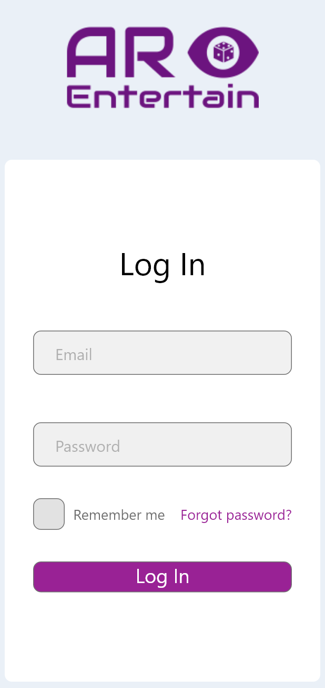

# SWEN303 2020 Final Project - Part 1 Prototyping - AR Entertain 1

# Background
**Introduction**

_Description_

AREntertain is a Education Management nonprofit organisation with the focus of the introduction of AR and VR technology for the next generation of tertiary students. With a mixture of educational and social activities, it tries to help future students with practical and real-world examples of various subjects. AREntertain is run with the help of Victoria University and other tertiary education providers. 

Offering lectures from tertiary educators and working professionals who will show and educate the participants. Also creating groups for like-minded students to share their knowledge and learn together. Using the tool to manage your groups and lectures that you want to participate in. They can also use the tool to manage and view your interests and timetable of all the lectures and events, and ask questions to the organizers and lecturers.

AREntertain is a multi-week program that ends with a big exhibition showcasing interactive industry examples and university projects. Participants will be encouraged to collaborate with others and tutors to create a small project. Participants who have created project groups are also able to showcase their work at the exhibition.

The program is co-run with the organizers of Summer of Tech.

_Business Objectives_

Some students have trouble deciding what to study and giving them practical examples and lectures will help them decide if software engineering is what they want to study. Giving people who still have not decided what they want to study an opportunity to listen in on a few lectures and see if they are interested in the topics. AREntertain objective is to educate and inspire future engineers. Inspiring them with university projects worked on by students during summer scholarships and possibilities of working summer internships in the industry with the partnership with Summer of Tech. 

Another objective is to introduce the use of AR to people who have never used the technology. Giving the participants AR experience at lectures and the exhibition.

The tool should be easy and simple to use, as is to help make participation in the program easier and connecting like-minded students. The tool should also be as efficient as possible for lecturers and tutors so more time can be spent teaching material to students.

_Importance to Stakeholders_

AREntertain will be a vital program for inspiring future engineers. It will give students an understanding of where the industry is at the moment and where it is heading, and giving them the support they need to see if they are interested in studying software engineering. Having support from the industry leaders in VR/AR in New Zealand and Summer of Tech, AREntertain will help create the necessary engagement of interest.

# Personas

# Scenarios

# Designs ideation

# Design review

# Prototype
### Login screen:

A straightforward app login screen. Allows users to stay logged in and quickly reset their password. Uses the keyobard of the operating system on which the app is running.

### Home page:
The home pages allows the user to quickly access more important information. The calendar section displays upcoming event dates for the current month. The messages tab displays the most recently received messages from the users' group chats. The notifications tab displays a condensed version of the user's event notifications. Each tab can be hidden away so that the user can ignore aspects of the app that they are not using, such as if they have never joined any groups.

### Topbar:
The topbar appears on all pages of the app and contains context-sensitive buttons such as a back or search button as needed. The burger menu button is available on all pages, allowing users to quickly navigate to the page they want.

### Burger Menu:
The burger menu is the primary means of navigation for users throughout the app. It lists the app's main pages so the user can quickly access them. Because the features on the bottom bar are less likely to be used frequently by the user, they are represented by application standard icons rather then being listed like the others.

### My profile pages:
The my profile pages allow users to view and set their interests for other aspects of the app, as well as other user information such as name and profile picture.

### Explore Pages:
The explore pages are where users can learn about engineering events and groups. The page is divided into three tabs.

The events tab displays the user's upcoming events, sorted by month, and includes the date of the event in the poster's corner. Poster images are used to entice users to attend the events and to match scanned in posters. Scrolling down the page will take you through the months, while scrolling across will take you through the events of that month. Tapping an event brings up its card, which contains additional information about the event, such as where it is and how many seats are available.

The groups tab is similar to the events tab, but it displays groups sorted by the tags they've assigned to them. When you tap a group, you will be taken to the group page, where you can join and view the group messages.

The interests tab combines the events and groups tabs, filtering all available events and groups based on the tags the user has specified on their profile.

### My events page:
The my events page, similar to the explore page about events, allows users to see what events they've signed up for and read more about them, sorted by the months they’re happening.

### My groups page:
The my groups page, similar to the explore page about groups, allows users to see what groups they've joined up and send messages to them, sorted by their tags. The group messages page allows users to chat and send information to one another.

### Notifications page:
Displays the notifications that the user has received. Because the notifications would be pushed to the user's phone OS as well, it isn't as prominently accessible as the other pages.

### QR Scan page:
A straightforward page that displays the camera on the user's phone, which can then be used to scan an affiliated poster. When scanned, the event page for the event advertised on the poster will appear.

### Tutorial/Setup pages:
A set of tutorial pages for the app, which would have video demonstrations in place of the stock photos for whatever the slide is educating the user on. It can take the user to the relevant area of the app the tutorial is teaching, as well as being entirely skippable for experienced users. The pages would be forced on the user the first time they opened the app, but they would be accessible at any time by tapping the question mark in the burger menu afterwards.

### Settings page:
Allows the user to change the colour scheme of the app, which isn't available in the prototype. In the future, users would also have the option of deleting their account or logging out, and other similar options.
# Video

# Group Reflection
